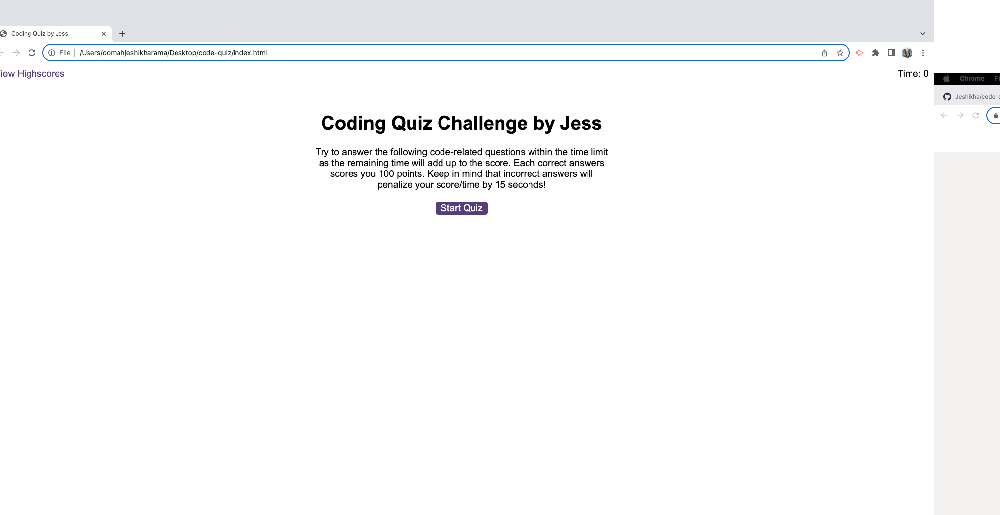
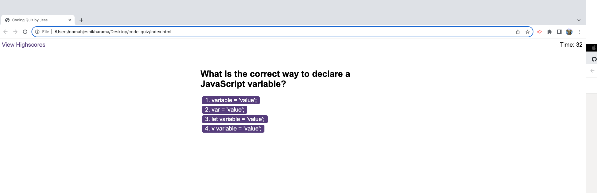
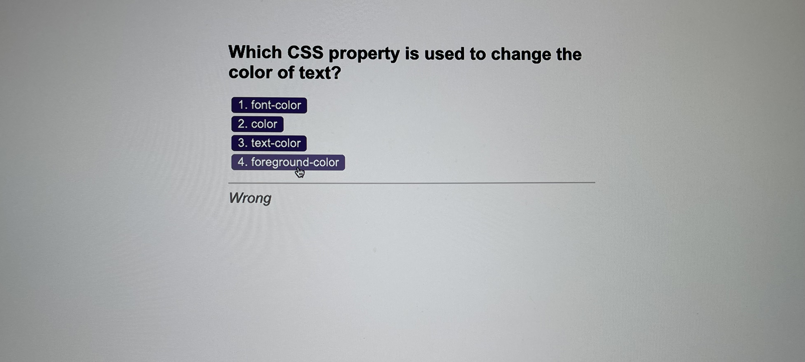
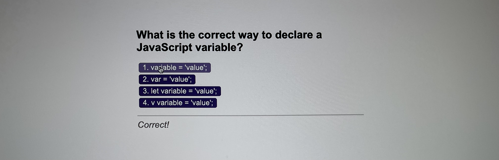
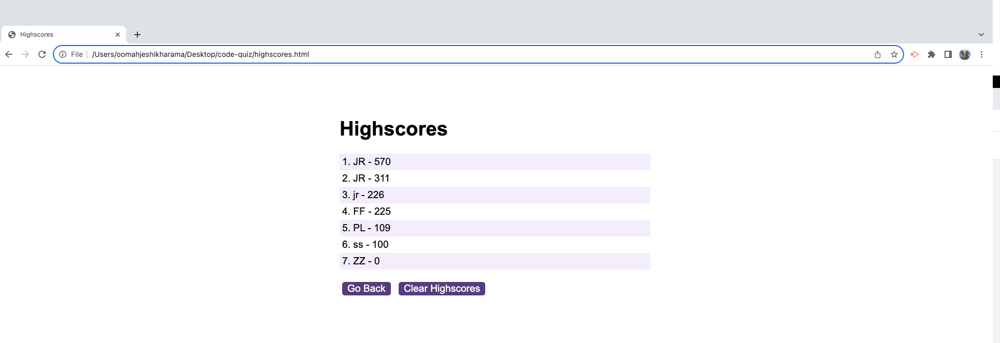
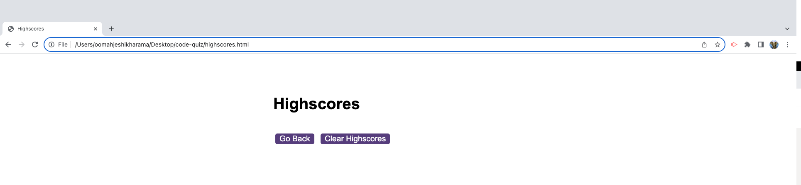
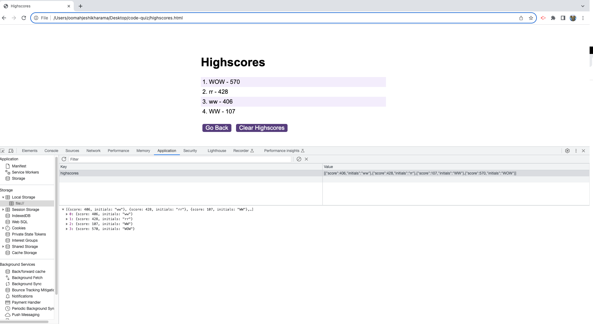

# Coding Quiz Challenge

## Overview
The Coding Quiz Challenge is a web-based application that I developed to offer users a timed quiz on JavaScript, HTML and CSS fundamentals while also enabling the storage of high scores. This project was a significant step in applying the knowledge gained in a coding boot camp to a real-world scenario. This project features a dynamic and responsive user interface powered by HTML, CSS, and JavaScript. It follows the structure and principles of a typical coding assessment, offering a combination of multiple-choice questions and interactive coding challenges. The quiz is timed, and incorrect answers lead to time deductions, simulating the conditions of a real coding challenge. Each correct answers will score the candidate 100 points. The challenge was multifaceted, requiring the implementation of features such as a timer, multiple-choice questions, score calculation, and local storage usage. This hands-on experience led to a deeper understanding of event listeners, HTML element manipulation, and the overall flow of functions in a web application. It was an opportunity to overcome obstacles and gain practical insights into front-end web development.

## Project Details

### How to Play the Coding Quiz Challenge

#### Start the Quiz: 
Click the "Start Quiz" button to initiate the challenge.
#### Answer Questions:
You'll be presented with a series of multiple-choice questions related to JavaScript, HTML, CSS, and APIs.
Choose your answer by clicking on one of the provided options.
#### Timer:
A timer will begin counting down from a set time, giving you a time limit for each question.
Incorrect answers will deduct 15 seconds from your remaining time.
#### Feedback:
After answering, you'll receive immediate feedback on whether your answer was correct or not.
Correct answers trigger a "Correct!" message, 100 points and a sound effect.
Incorrect answers trigger a "Wrong" message and a time deduction.
#### Progress:
Your progress is tracked by the number of questions you've answered correctly.
#### Game Over:
The game ends when you've answered all questions or when the timer reaches zero.
#### High Score:
After the game ends, you'll be prompted to enter your initials.
High scores are calculated based on the number of correct answers and the remaining time (each correct answer is worth 100 points).
Your score is saved along with your initials in local storage.
#### View Highscores:
You can click on "View Highscores" to see a list of top scores.
Highscores are sorted from highest to lowest.
#### Clear Highscores:
If you wish to clear the highscores, you can click on the "Clear Highscores" button.
#### Retake the Quiz:
You can retake the quiz by clicking the "Start Quiz" button on the home screen.

### JavaScript Functionalities
- **Timer:** 
The quiz starts with a timer that counts down as the user progresses through the questions. Incorrect answers lead to time deductions (15 seconds), adding an element of urgency.
- **Question Progression:** 
Questions are presented one by one, and users can advance to the next question by selecting an answer.
- **Scoring:** 
The application tracks and calculates scores based on correct answers and the remaining time. Notifying the candidate of "Correct" AND "Wrong" answers. Each correct answers scores 100 points and total of Correct Answers plus remaining time will give the End Score.
- **High Scores:** 
Users can save their initials and view their scores on the high scores leaderboard.
- **Sound Effects:** 
Sound effects for correct and incorrect answers, enhancing the gaming experience.
- **Clear High Scores:** 
Users have the option to clear high scores and start fresh.
- **Local Storage:** 
    - Store High Scores: After completing the quiz, user initials and scores are saved in Local Storage, enabling users to track and compare their performance. 
    - Retrieve High Scores: On the "Highscores" page, high scores are retrieved from Local Storage and displayed in a leaderboard format.
    - Clear High Scores: Users can choose to clear their high scores, removing the data from Local Storage.

## Files Created
The project includes the following files:
- `index.html`: The main HTML file for the quiz.
- `logic.js`: The JavaScript code for quiz functionality.
- `questions.js`: The file containing the quiz questions.
- `scores.js`: The JavaScript code for managing and displaying high scores.
- `styles.css`: The CSS stylesheet for styling the quiz.
- `highscores.html`: The HTML file for viewing high scores.

## Challenges Faced
Developing the Coding Quiz Challenge was a comprehensive learning journey that came with its set of intricate challenges and demanded approximately 17 hours of dedication to bring all these elements together. 
Firstly, understanding the precise requirements and mechanics of the quiz, such as managing the timer and calculating scores, took some time to grasp fully. Incorporating my own scoring logic, which included combining correct answers and time deductions, was particularly challenging. Additionally, implementing Local Storage to persist high scores between sessions added complexity to the project. Another area of focus was creating a polished user interface with dynamic content and handling user interactions for inputting initials and high score navigation. These challenges, while demanding, ultimately contributed to a deeper understanding of JavaScript, HTML, and CSS. 

## Tools and Technologies Used
* Virtual Studio Code: primary code editor - HTML, CSS, JavaScript
* Git and GitHub: Facilitated collaborative development and version management.
* Audio Files: Sound effects were included in the project for interactive feedback.

## Research Resources and Collaborative Efforts
This achievement wouldn't have been possible without the aid of resources like the Mozilla Developer Network (MDN) and Google, which offered extensive documentation and solutions to coding issues. Mentors such as Drew and Nazeh, as well as supportive classmates, provided essential guidance and assistance throughout the project. Their collective contribution significantly enriched the learning experience.

## Project Outcome 
The "Coding Quiz Challenge" project is a fully functional and engaging web application. It successfully meets all the specified user story and acceptance criteria. Users can play the quiz, experience a timed challenge, receive immediate feedback, save their high scores, view top scores, and even clear high scores when desired. The application seamlessly integrates HTML, CSS, and JavaScript to provide an interactive and educational experience for coding enthusiasts. It has been thoroughly tested and is working as intended, offering an effective way to test and improve one's web development knowledge.

## License
This project is licensed under the MIT License.

## Deployment - Useful Links to facilitate viewing of project
• The URL of the GitHub repository: https://github.com/Jeshikha/code-quiz

• The URL of the functional, deployed application on GitHub Pages: https://jeshikha.github.io/code-quiz/    

## Screenshots of Deployed App
The following imageS show the web application's Coding Quiz and output through formula:

* Webpage opening - Start Quiz

* Multiple Choice Questions and Count starts/ Timer is On

* Choosing Wrong Answer Notification

* Choosing Correct Answer Notification

* Quiz Ending and Total Score - Prompting for Intials to log data

* Highscores of users are listed and sorted from highest to lowest.

* Clearing Highscores and no data left

* Inspecting Local Storage Application

